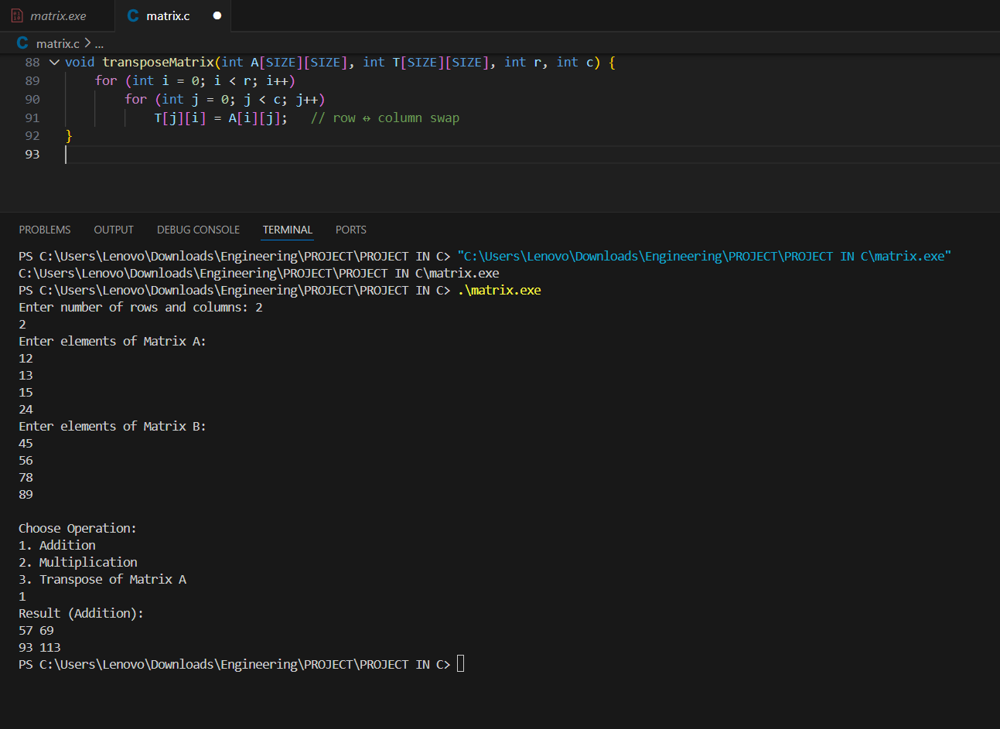
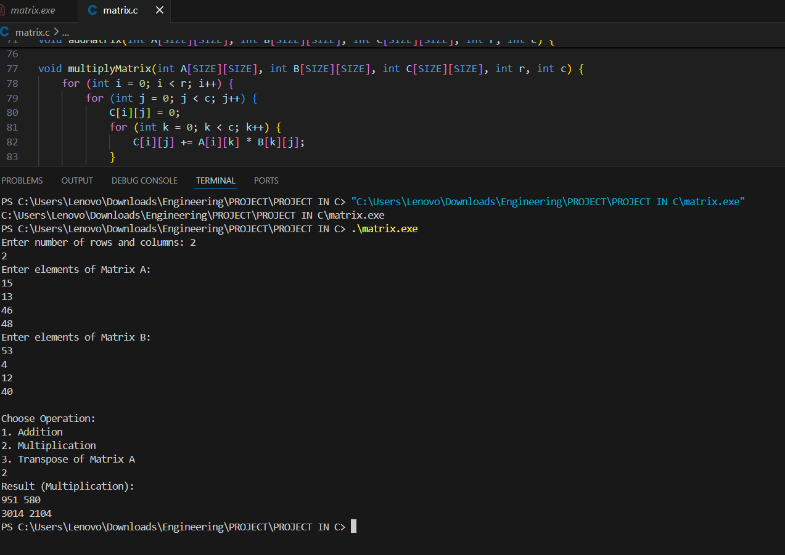
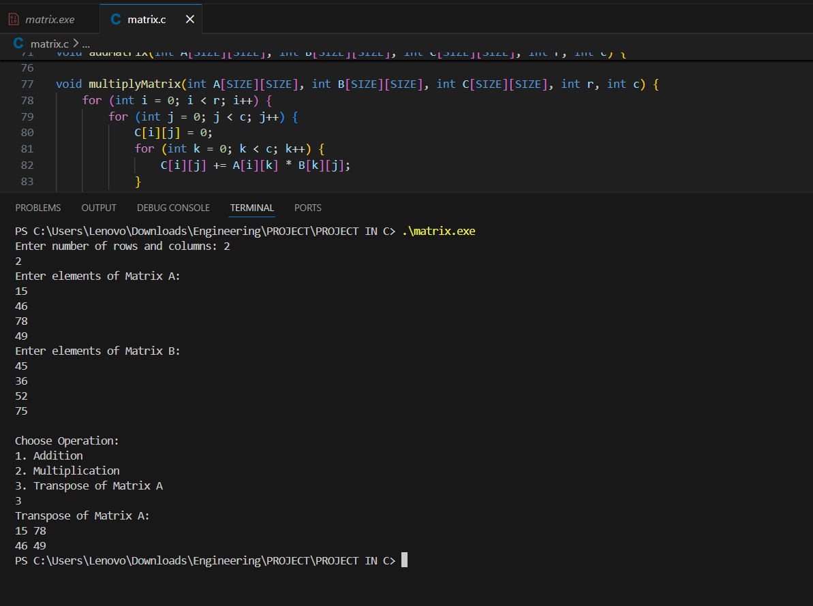

## 📘 Matrix Operations in C

## 🔎 Overview
This project demonstrates **basic matrix operations** implemented in C using modular functions.  
It includes:
- Addition  
- Multiplication  
- Transpose  

The program is designed for **academic learning, RTU practical files, and internship projects**. It highlights how to structure C code using functions for clarity and reusability.

---

## 🛠️ Features
- Input two matrices from the user  
- Perform **Addition** of matrices  
- Perform **Multiplication** of matrices  
- Compute **Transpose** of a matrix  
- Modular design with separate functions for each operation  
- Clean output formatting  

---

## 📂 File Structure
   Matrix-Operations/
   
│── matrix.c        # Main C program with functions

│── README.md       # Documentation 

---

## ⚙️ How to Compile & Run

    ```bash
          gcc matrix.c -o matrix
          .\matrix.exe

---
## Exanple 
Enter number of rows and columns: 2 2
   ```
       Enter elements of Matrix A:
           1 2
           3 4
        Enter elements of Matrix B:
           5 6
          7 8

```
Choose Operation:
1. Addition
2. Multiplication
3. Transpose of Matrix A


    ```output

         Result (Addition):
             6 8
             10 12


          Result (Multiplication):
              19 22
              43 50


           Transpose of Matrix A:
                1 3
                2 4
 
---

## 📸 Sample Output

### Addition


### Multiplication


###  Transpose of Matrix A


---

| Function Name | Purpose |
| --- | --- |
| ``inputMatrix()`` | Reads matrix elements from user input |
| ``displayMatrix()`` | Prints matrix neatly |
| ``addMatrix()`` | Performs element-wise addition |
| ``multiplyMatrix()`` | Performs multiplication (row × column rule) |
| ``transposeMatrix()`` | Computes transpose (row ↔ column swap) |

---

## 🎯 Learning Outcomes
Understand matrix operations in C

Learn function-based modular programming

Practice row-column logic for multiplication and transpose

Improve skills in structured coding and documentation

---

*👨‍💻 Author: Sonu Thuniya*

📅 Internship Task – C PROGRAMMING 

---


## 🙏 Acknowledgement
I would like to express my sincere gratitude to **Code Alpha** for providing me with the opportunity to work as an intern.  
This internship has been a valuable learning experience, allowing me to strengthen my programming skills, gain practical exposure, and apply theoretical knowledge to real-world projects.  
The guidance and support received during this internship have motivated me to continue improving and exploring new areas in software development.

---


